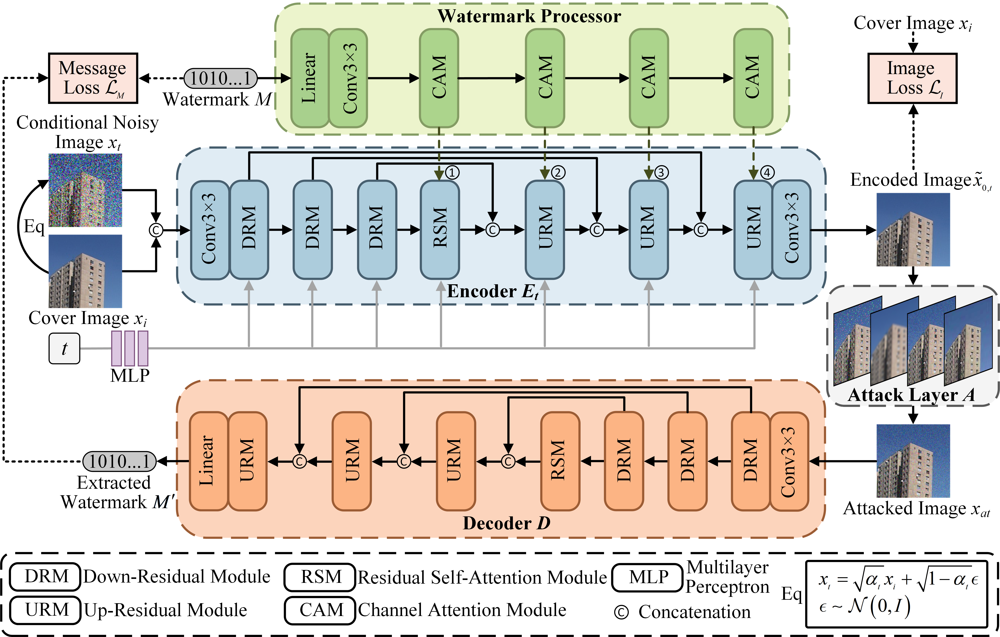

# DiffW: Multi-Encoder Based on Conditional Diffusion Model for Robust Image Watermarking



****

## How to use our Code?

Here we provide an example for the **Robust Image Watermarking**, but it can be changed to solve other problems by replacing the dataset.

We retrained the model from scratch using a single Nvidia 4090 GPU.

Note that **we didn't tune any parameter**, the last saved checkpoint was used to evaluation.

****

## Dataset
### Dataset Preparation

Please download ImageNet or COCO datasets, and push them into `data` folder like this : 

```
├── data
│   ├── CoCo
│   │   ├──train
│   │   │  ├──gt
│   │   │  │   ├── xxx.jpg
│   │   │  │   ├── ...
│   │   │  ├──input 
│   │   │  │   ├── xxx.jpg
│   │   │  │   ├── ...
│   │   ├──test
│   │   │  ├──gt
│   │   │  │   ├── xxx.jpg
│   │   │  │   ├── ...
│   │   │  ├──input 
│   │   │  │   ├── xxx.jpg
│   │   │  │   ├── ...
├── ...
```

Set the input and gt to be the same image.

****

## Train

Change the settings in file `./configs/CoCo.yml` and `train_diffusion.py`, then run :

```bash
python train_diffusion.py
```

Then the models and training logs will save in `./logs/`. The results will be saved at `./results/xxx/`.

## Test

Change the settings in file `./configs/CoCo.yml` and `eval_diffusion.py`, then run :

```bash
python eval_diffusion.py
```

The results will be saved at `./results/xxx/`

## Noise

Change the Noise settings in Python file `Noise.py`.

****

## Acknowledgement
Our code is adapted from the original [WeatherDiffusion](https://github.com/IGITUGraz/WeatherDiffusion) and [MBRS](https://github.com/jzyustc/MBRS) repository. We thank the authors for sharing their code.

****

## Citation

If our work is useful for your research, please consider citing:
```
@ARTICLE{11249441,
  author={Luo, Ting and Hu, Renzhi and He, Zhouyan and Jiang, Gangyi and Xu, Haiyong and Song, Yang and Chang, Chin-Chen},
  journal={IEEE Transactions on Multimedia}, 
  title={DiffW: Multi-Encoder Based on Conditional Diffusion Model for Robust Image Watermarking}, 
  year={2025},
  volume={},
  number={},
  pages={1-16},
  doi={10.1109/TMM.2025.3632631}
}
```

****
#### --- Thanks for your interest! --- ####
